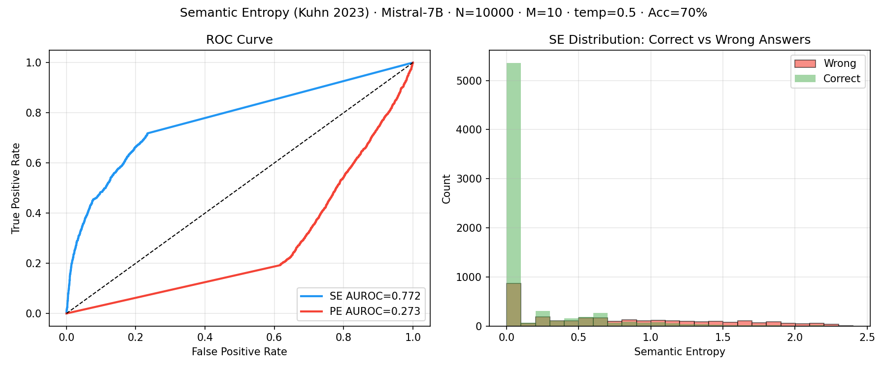
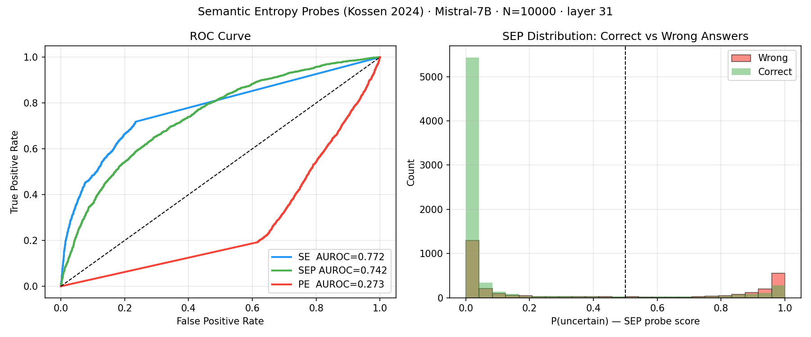
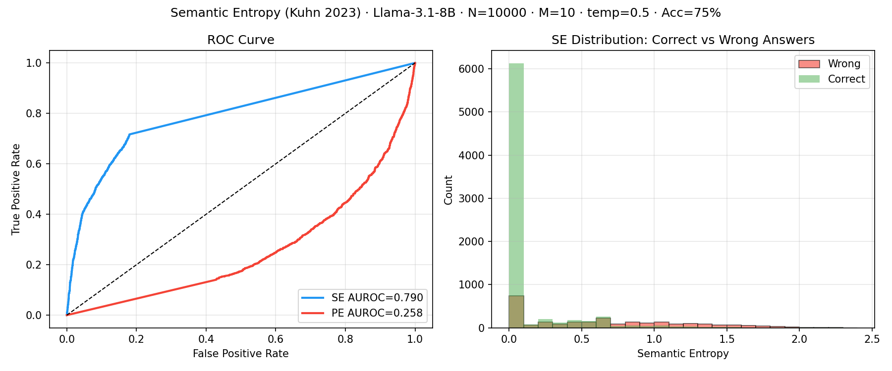
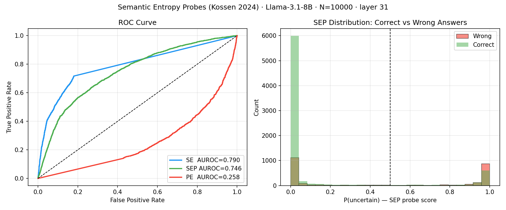
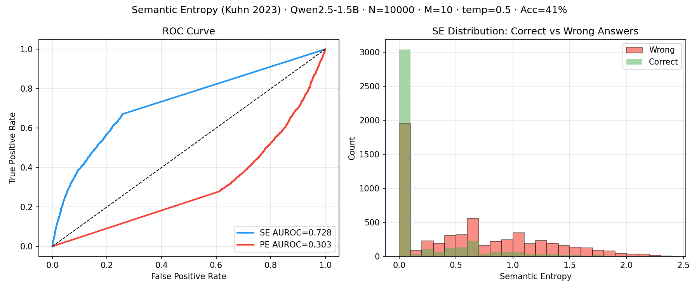
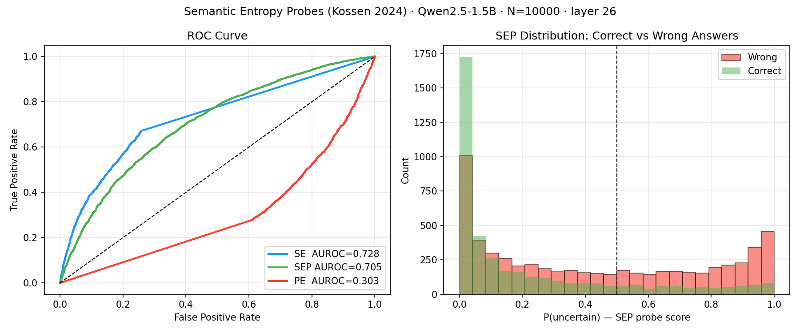

# Hallucination Detection via Semantic Entropy

---

## 1. Introduction

LLMs frequently generate factually incorrect content with high confidence—a phenomenon termed "hallucination." Rather than signaling uncertainty, the model generates plausible-sounding sentences that contain the wrong information.

Standard token-level predictive probability fails as a reliable uncertainty metric due to the inherent flexibility of natural language. A model that is entirely certain of a fact may distribute its token probabilities across multiple valid lexical and syntactic phrasings, artificially inflating apparent uncertainty.

> **Example:** "Alexander Graham Bell invented the telephone" and "The telephone was invented by Bell" share identical semantic meaning, yet they register as different outcomes under token-based entropy.

This project centers on reproducing Semantic Entropy (Kuhn et al, 2023) as the expensive teacher method and Semantic Entropy Probes (Kossen et al, 2024) as the cost-effective approximation for production.

---

## 2. Methods

### 2.1 Semantic Entropy: (Kuhn, 2023)  

Standard **Predictive Entropy (PE)** measures token-based entropy which gets inflated by paraphrasing and expressing the same information in different lexical and syntactic variations.

```
PE = -∑_s  p(s|x) · log p(s|x)
```

**Semantic Entropy (SE)** collapses different completions into meaning clusters first, then computes entropy over these clusters:

```
SE = -∑_c  p(c|x) · log p(c|x),   p(c|x) = ∑_{s ∈ c} p(s|x)
```

High SE means the model's answers genuinely disagree on meaning, and this is treated to be a strong hallucination signal.

> **Key insight:** These SE based algorithms don't judge whether a specific completion is a hallucination. Instead, they aim to detect whether the LLM is in a hallucination-prone state. A high SE score means the model lacks a stable answer to draw from —-i.e. the prompt has put the model in a high-entropy region of its knowledge base. The known blind spot follows directly: if the model is consistently wrong in the same way across all M samples, SE = 0 and the hallucination tendency doesnt get flagged leading to a False Negative.

Step by Step algorithm:
1. **Sample:** draw M=10 completions at temperature 0.5. Record length-normalized log-probs for each: `log_prob = (1/n) · ∑ log p(token_i)`
2. **Cluster:** Run DeBERTa NLI bidirectionally against each cluster's representative, assign on mutual entailment, else initiate a new cluster -- O(M * C). (N.B. The representative is simply the first answer placed into that cluster, introducing an additional source of randomness into the algorithm.)
3. **Aggregate:** sum sentence probabilities within each cluster: `p(c) = ∑_{s∈c} exp(log_prob_s)`
4. **Entropy:** `SE = -∑_c p(c) · log p(c)`. 
      SE = 0: one shared meaning (low hallucination signal). 
      SE = log(10) (=2.3 in natural log): Each sample differs in meaning (high hallucination signal)
5. **Evaluate:** SE is the hallucination score.
      Based on the Rouge Score of the descriptive sentence of each cluster, decide on the label of the cluster.
      Binary Label = RougeL(best answer, gold) > 0.3. -> Plot ROC and compute AUROC.

---

### 2.2 Semantic Entropy Probes: (Kossen, 2024) 

Kuhn's algorithm makes M=10 inferences per prompt, then uses cross-encoder DeBERTa to assess if there's mutual entailment between the sampled sentences. This is a major production bottleneck due to excessive compute. Kossen's insight is that **the model already encodes its uncertainty in the hidden states before generating a single output token**. Kossen's algorithm trains a linear model on the last token embedding as input feature and the A cheap linear probe can be trained once to read it out.

**Training (one-time):**

1. **Run Kuhn's pipeline** on N questions (can bump up the number of questions to train a more robust probe) -> one SE score per question. This becomes the teacher model, where we use the SE outputs to train a smaller linear model.
2. **Binarize SE scores**: Obtain  0/1 labels.
3. **Run one forward pass** for the same N questions -> For each layer, extract the hidden state of the last input token position (collect a dataset of dim `(N, d)`).
4. **Training**: For each layer, train a logistic regression with last token embedding to predict SE score (Label = 0 (no hallucination), Label=1, (hallucination)). Then pick the layer with highest validation AUROC.
5. **Re-train best model**:  Refit the final logistic regression on all training data at this best layer. 
6. **Inference** At runtime, we only extract the hidden state from the best layer --($O(1)$.

**Inference:**

1. One forward pass through the LLM.
2. Slice `hidden_state[best_layer][-1]`, shape `(d,)`.
3. `P(uncertain) = sigmoid(W · h + b)`, one matrix multiply.

No sampling 10 completions, No semantic clustering with a DeBERTa cross-encoder. 

---

### 2.3 INSIDE: Chen et al. (ICLR 2024)  *(not implemented)*

Two mechanisms operating on K=10 response embeddings at the **middle transformer layer** (≈ L/2):

**EigenScore:** build a covariance matrix Σ = Z^T · J · Z over the K hidden-state vectors Z. Score = (1/K) Σᵢ log(λᵢ). When responses are semantically similar, eigenvalue mass concentrates on one component (low score). When they diverge, eigenvalues spread (high score). No NLI needed, semantic divergence is captured in embedding geometry. Reported AUROC on TriviaQA/Llama-7B: ~83% vs ~65% for SE.

**Feature Clipping:** a forward hook that clips extreme activations in the penultimate layer using percentile thresholds from a calibration set. Unlike Kossen (read-only), this *modifies* the computation graph at inference time. Reduces overconfident generations without retraining. Full implementation spec in [src/ctgt/inside_2024/inside.py](src/ctgt/inside_2024/inside.py).

---

### 2.4 Method comparison

| Method | Model access | Per-query cost | Key idea | Status |
|---|---|---|---|---|
| Kuhn / Farquhar SE | Logprobs | M=10 samples + NLI | Entropy over semantic clusters | ✅ implemented |
| Kossen SEP | Hidden states (read) | 1 forward pass | Linear probe on last-input-token activation | ✅ implemented |
| Chen INSIDE | Hidden states (read + write) | K=10 samples, no NLI | EigenScore on mid-layer covariance + activation clipping | ❌ not implemented |

The progression represents increasing depth of access: output probabilities -> reading internals -> modifying internals.

---

## 3. Dataset: TriviaQA

We evaluate on **TriviaQA** `rc.nocontext` (validation set, 17,944 questions): trivia answered from memory, no supporting document. Closed-book forces genuine uncertainty: the model either knows the answer or it doesn't.

**Correctness criterion:** RougeL(model answer, any gold alias) > 0.3.

RougeL is the F-score of the Longest Common Subsequence between reference X (length m) and prediction Y (length n):

$$R_{lcs} = \frac{LCS(X,Y)}{m}, \quad P_{lcs} = \frac{LCS(X,Y)}{n}, \quad \text{RougeL} = \frac{2\,R_{lcs}\,P_{lcs}}{R_{lcs} + P_{lcs}}$$

We check the model's primary answer against every gold alias, a match on any alias counts as correct.

**Train / eval split.** TriviaQA is not randomly ordered — questions are grouped by source document — so we shuffle the full validation set with a fixed seed before slicing. This gives two disjoint sets that share no questions:

- **Set A (eval, N=10,000, offset=0):** held out for evaluating Kuhn SE and Kossen SEP. Neither algorithm sees these questions during training.
- **Set B (train, N=10,000, offset=10,000):** used to train the Kossen linear probe. The full Kuhn pipeline (M=10 samples + NLI) is run on Set B to generate SE labels; a logistic regression is then fit to the hidden states extracted from these same questions. Set B is never used for evaluation.

The reason Set B needs N=10,000 is that the logistic regression operates in d=4096 dimensional space. At N=300 the problem is underdetermined (more features than samples) and the probe underfits.

---

## 4. Hallucination Detection: End-to-End

For each question the system produces a **primary answer** (representative of the highest-probability semantic cluster) and an **SE score** (a scalar in [0, log M] measuring semantic diversity across M samples). The SE score drives a threshold detector:

```
SE ≥ τ  ->  flag as hallucination
SE < τ  ->  return answer to user
```

Rather than fixing τ and measuring accuracy, we sweep τ and compute **AUROC**, the probability that a randomly chosen hallucinated answer has higher SE than a randomly chosen correct answer. AUROC = 0.5 is random. AUROC = 1.0 is perfect separation.

*Example: "Who invented the telephone?"*

```
s1:  "Alexander Graham Bell"      log_prob = -0.12 ┐
s2:  "Bell invented it in 1876"   log_prob = -0.15 ├─ Cluster 1  p = 0.95
s3:  "The telephone is Bell's"    log_prob = -0.18 ┘
s10: "Nikola Tesla"               log_prob = -2.10  ── Cluster 2  p = 0.05

SE = -(0.95·log 0.95 + 0.05·log 0.05) = 0.20  ->  low uncertainty
```

**Hyperparameters**

| Parameter | Value | Rationale |
|---|---|---|
| Samples M | 10 | Diminishing returns beyond 10 (Kuhn et al., Fig. 3b) |
| Temperature | 0.5 | Balances diversity vs accuracy |
| Max new tokens | 128 | Sufficient for factual QA |
| Default threshold τ | ln(2) = 0.69 | Entropy of a 50/50 split between two meanings |

---

## 5. Results

TriviaQA `rc.nocontext`, M=10 samples, temp=0.5, Modal A10G GPU. Kuhn SE and Kossen SEP are evaluated on disjoint question sets (Set A / Set B, N=10,000 each, same shuffle seed, no overlap).

### 5.1 Summary

**Kuhn SE vs Kossen SEP: hallucination detection AUROC**

| Model | Acc | Kuhn SE AUROC | Kossen SEP AUROC | SEP gap |
|---|---|---|---|---|
| Mistral-7B-Instruct-v0.3 | 70% | 0.772 | 0.742 | −0.030 |
| Meta-Llama-3.1-8B-Instruct | **75%** | **0.790** | **0.746** | −0.044 |
| Qwen2.5-1.5B-Instruct | 41% | 0.728 | 0.705 | −0.024 |
| Kuhn et al. (OPT-30B) | ~50% | ~0.830 | n/a | n/a |

SEP probes recover 94–97% of SE's AUROC using a single forward pass: no sampling, no NLI.

**Full details**

| Model | Params | PE AUROC | Kuhn wall time (N=300) | Kossen inference wall time (N=300) | Speedup | SEP best layer |
|---|---|---|---|---|---|---|
| Mistral-7B-Instruct-v0.3 | 7B | 0.273 | 75s | 50s | 1.5x | 31 |
| Meta-Llama-3.1-8B-Instruct | 8B | 0.258 | 108s | 70s | 1.5x | 31 |
| Qwen2.5-1.5B-Instruct | 1.5B | 0.303 | 90s | 31s | 2.9x | 26 |

Wall times measured over N=300 questions on A10G. Kuhn: M=10 LLM samples + NLI clustering per question. Kossen inference: 1 forward pass + probe per question (no sampling, no NLI). Wall-time speedup is lower than the theoretical 10x per-question speedup because Modal's autoscaling already parallelizes Kuhn's sampling across containers. The per-question serial cost ratio is ~10x, but both pipelines saturate available GPUs.

> **Note: why PE AUROC < 0.5**
> Instruction-tuned models learn two behaviors that both produce low token-level entropy:
> 1. The model knows the answer and generates it confidently. Low PE, correct.
> 2. The model does not know the answer, but has learned what a "good answer" sounds like stylistically, so it picks one confidently anyway. Low PE, **wrong**.
>
> Case 2 is the problem. Both correct and hallucinated answers look identical to PE: short, sharp token distributions, low entropy. Because hallucinated answers can be *more* peaked than hedged-but-correct answers, the ranking inverts and AUROC falls below 0.5.
>
> This is precisely why the word "hallucination" entered the vocabulary: the model is not failing silently (saying "I don't know") but actively generating a confident, well-formed answer that has no grounding in fact, the way a hallucinating person perceives something that is not there. SE sidesteps this entirely by comparing M outputs against each other on meaning, not by reading token probabilities.

### 5.2 Per-model results

Each model shows two figure pairs: **Kuhn SE** (ROC curve + SE distribution) and **Kossen SEP** (ROC curve + probe score distribution).

---

#### Mistral-7B-Instruct-v0.3

<p align="center"></p>

*Kuhn SE · Mistral-7B · N=10,000 · SE AUROC=0.772 · PE AUROC=0.273 · Acc=70% · 75s per 300q. PE falls below the diagonal: instruction tuning makes the model generate confident-sounding answers regardless of correctness, so hallucinated answers carry low entropy and rank above correct ones. SE is unaffected: "JFK", "John Kennedy", "John F. Kennedy" all land in one cluster.*

<p align="center"></p>

*Kossen SEP · Mistral-7B · N=10,000 · 5-fold CV · layer 31 · SEP AUROC=0.742 · gap=−0.030.*

---

#### Meta-Llama-3.1-8B-Instruct

<p align="center"></p>

*Kuhn SE · Llama-3.1-8B · N=10,000 · SE AUROC=0.790 · PE AUROC=0.258 · Acc=75% · 108s per 300q. Highest accuracy and SE AUROC of all tested models. Same PE inversion: confident wrong answers rank below confident correct ones.*

<p align="center"></p>

*Kossen SEP · Llama-3.1-8B · N=10,000 · 5-fold CV · layer 31 · SEP AUROC=0.746 · gap=−0.044.*

---

#### Qwen2.5-1.5B-Instruct

<p align="center"></p>

*Kuhn SE · Qwen2.5-1.5B · N=10,000 · SE AUROC=0.728 · PE AUROC=0.303 · Acc=41% · 90s per 300q. Smallest model, lowest accuracy. SE AUROC is competitive despite 1.5B parameters.*

<p align="center"></p>

*Kossen SEP · Qwen2.5-1.5B · N=10,000 · 5-fold CV · layer 26 · SEP AUROC=0.705 · gap=−0.024. Smallest probe gap of the three models.*

### 5.3 Discussion

**SEP recovers most of SE's signal with a single forward pass.** Across all three models, the SEP probe lands within 0.024–0.044 AUROC of the SE oracle. This is the central claim of Kossen et al. and it holds: the model's internal representation at the last input token position encodes nearly everything SE extracts through 10x sampling and NLI clustering. Kossen et al. report SEP AUROCs of 0.70–0.95 across models and datasets (TriviaQA, SQuAD, BioASQ, NQ Open); our 7B-class models land at 0.705–0.746 on TriviaQA alone, consistent with the lower end of their range. They trained probes on N=2,000 samples across all tasks combined; our N=10,000 single-task probes likely explain why our SEP–SE gaps are tighter.

**More training data matters.** With N=300 training questions the probe gaps were 0.034–0.058. At N=10,000 they compress to 0.024–0.044. Logistic regression on 4096-dimensional hidden states is underdetermined at N=300; the probe underfits. At N=10,000 it finds a stable decision boundary and recovers more of SE's signal.

**Larger models are better at both accuracy and detection.** Llama-3.1-8B has the highest factual accuracy (75%) and the highest SE AUROC (0.790). The two are correlated: a model with richer internal representations both answers more correctly and encodes uncertainty more legibly in its hidden states. Qwen-1.5B, despite being 5x smaller, is only ~0.06 AUROC behind on SE — suggesting SE is not purely a function of model scale.

**Best layer shifts with scale.** For the 7–8B models (Mistral, Llama), layer 31 of 32 wins. For Qwen-1.5B (28 layers), layer 26 wins. In both cases the winning layer is in the final quarter of the network — late enough to have attended to the full question context, but not the last layer (which handles output projection). This is consistent with Kossen et al.'s finding that later layers carry more semantic content for short-form QA.

**The confident hallucination blind spot is real and shared by both methods.** SE = 0 and PE = 0 are indistinguishable between a correct confident answer and a wrong confident answer. If a model consistently outputs the same wrong answer across all M=10 samples, both metrics assign it the lowest possible hallucination score. Neither SE nor SEP detects systematic bias; they only detect uncertainty.

### 5.4 Why Predictive Entropy Produces AUROC Below 0.5

AUROC measures how well a hallucination score ranks wrong answers above correct ones:

\[
\mathrm{AUROC} = P(s(x_{\text{hallucinated}}) > s(x_{\text{correct}}))
\]

SE AUROC = 0.79 means hallucinated answers receive higher SE than correct answers 79% of the time. PE AUROC < 0.5 means the opposite: PE systematically ranks correct answers as *more* uncertain than hallucinated ones.

PE fails because it measures lexical uncertainty, not semantic uncertainty. Correct answers often have high PE — the same fact expressed through aliases, qualifiers, or varied syntax generates diverse token sequences. Hallucinated answers from an instruction-tuned model tend to have low PE: the model picks one confident, plausible-sounding entity and states it flatly. This ranking inversion is not noise; it is a structural artifact of instruction tuning. SE fixes it by collapsing lexical variants into meaning clusters before computing entropy.

---

## 6. Limitations

**Requires logprob access.** SE needs token-level log-probs from the generating model. Black-box APIs (e.g. GPT-4 via OpenAI) do not expose these. Any open-source model works.

**Does not detect confident hallucinations.** If the model is consistently wrong in the same way across all M=10 samples, SE = 0 and the answer is not flagged. SE detects *uncertainty*, not *incorrectness*.

**NLI errors add noise.** DeBERTa achieves **92.7% accuracy** for semantic equivalence (Kuhn et al.). Errors in either direction corrupt the SE estimate.

**Scale matters.** OPT-2.7B shows SE AUROC ≈ 0.5. Model capability is a prerequisite for SE to be informative. Kuhn et al. achieve ~0.83 with OPT-30B.

---

## 7. System Design: Real-Time Inference with Kossen's SEP algorithm 

The key architectural property of Kossen's SEP probe is that it decouples the hallucination score from the generation step. The two operations share the same forward pass, so they can run on the same request without any extra LLM call.

### 7.1 Request flow

```
                    ┌──────────────────────────┐
                    │    Incoming question, Q  │
                    └────────────┬─────────────┘
                                 │
                                 ▼
                    ┌──────────────────────────┐
                    │     LLM forward pass     │
                    │     (1 pass)             │
                    └────────────┬─────────────┘
                                 │ hidden states available
                    ┌────────────┴────────────┐
                    ▼                         ▼
         ┌───────────────────┐    ┌─────────────────────────┐
         │  Token generation │    │   Probe evaluation      │
         │  via LLM          │    │   h[best_layer][-1]     │
         │  inference        │    │   -> sigmoid(W * h + b) │
         └──────────┬────────┘    └───────────┬─────────────┘
                    │                         │
                    │      answer string A    │  P(uncertain) ∈ [0,1]
                    └────────────┬────────────┘
                                 │
                                 ▼
                    ┌────────────────────────────┐
                    │        Response            │
                    │  { answer: A,              │
                    │    hallucination_risk: p } │
                    └────────────────────────────┘
```

The probe runs at the **last input token position**, the point where the model has attended to the full question but has not yet emitted a single output token. The hidden state at that position is already computed as part of the prefill step. Slicing it and running `sigmoid(W·h + b)` adds negligible latency (~0.5 ms) on top of the prefill.

Token generation then proceeds in parallel (or sequentially, depending on implementation) from the same KV cache. No second forward pass is needed.

### 7.2 Infrastructure

```
Client
  │  HTTP POST /ask  { question }
  ▼
API Gateway
  │
  ▼
Inference Server (single A10G)
  ├── LLM weights loaded once, resident in GPU VRAM
  ├── Probe weights (4096 x 1 float32, ~16 KB) loaded at startup
  │
  │  Per request:
  │  1. Tokenize Q -> input_ids
  │  2. Prefill forward pass -> KV cache, hidden_states[all layers]
  │  3. Slice hidden_states[best_layer][-1] -> h  (shape: d_model)
  │  4. Probe score  p = σ(W · h + b)            (< 1 ms)
  │  5. Autoregressive decode from KV cache -> answer A
  │  6. Return { answer: A, hallucination_risk: p }
```

**One GPU, one request, zero extra LLM calls.** The probe is a 16 KB weight matrix, negligible to store and compute.

### 7.3 Latency budget (Mistral-7B, A10G)

| Step | Latency |
|---|---|
| Tokenize | < 1 ms |
| Prefill (question, ~20 tokens) | ~10 ms |
| Probe score | < 1 ms |
| Decode (answer, ~30 tokens) | ~200 ms |
| **Total** | **~210 ms** |

The probe adds < 0.5% overhead to total request latency.

### 7.4 Offline training (one-time)

The probe must be trained before deployment. This is a one-time offline cost:

1. **Collect training data:** run the full Kuhn pipeline on N ≥ 500 questions -> SE score per question. This is the only step that requires M=10 samples and NLI. Takes ~75s per 300 questions on A10G.
2. **Binarize:** Otsu threshold γ* on SE scores -> 0/1 uncertain labels.
3. **Extract hidden states:** one forward pass per question, slice `hidden_states[layer][-1]` at every layer.
4. **Grid-search layers:** fit logistic regression per layer, pick best validation AUROC. For 7–8B models, layer 21 (of 32) consistently wins.
5. **Save probe:** `W` (d_model x 1) + `b` (scalar) + `best_layer` index -> `sep_probe_<model>.pkl`.

Re-training is only needed when the base LLM changes. The probe is not updated at inference time.

---

## 8. Future Work

**INSIDE (Chen et al., ICLR 2024, 356 citations):** EigenScore + feature clipping. No NLI, operates in embedding geometry. Requires forward hooks to modify activations in-flight. Full spec in [src/ctgt/inside_2024/inside.py](src/ctgt/inside_2024/inside.py).

**Diversity-steered sampling (Park & Cho, NeurIPS 2025):** penalize semantically redundant outputs during generation. Same AUROC with ~4 samples instead of 10, 60% LLM cost reduction with no architecture changes.

**p(True) baseline (Kadavath et al., 2022):** ask the model "is your answer correct?" as a self-evaluation signal. A third AUROC comparison point alongside SE and PE.

**Larger models:** Mistral-7B hits 70% accuracy, Llama-3.1-8B hits 75%. Qwen2.5-7B or larger would push accuracy further and close the gap to Kuhn et al.'s ~0.83 SE AUROC on OPT-30B.

---

## References

- Farquhar, S., Kossen, J., Kuhn, L., & Gal, Y. (2024). *Detecting Hallucinations in Large Language Models Using Semantic Entropy.* Nature. **1561 citations.** [arXiv:2303.08896](https://arxiv.org/abs/2303.08896)
- Kuhn, L., Gal, Y., & Farquhar, S. (2023). *Semantic Uncertainty: Linguistic Invariances for Uncertainty Estimation in Natural Language Generation.* ICLR 2023. [arXiv:2302.09664](https://arxiv.org/abs/2302.09664)
- Kossen, J., Han, J., Razzak, M., Schut, L., Malik, S., & Gal, Y. (2024). *Semantic Entropy Probes: Robust and Cheap Hallucination Detection in LLMs.* **161 citations.** [arXiv:2406.15927](https://arxiv.org/abs/2406.15927)
- Chen, C., Liu, K., Chen, Z., Gu, Y., Wu, Y., Tao, M., Fu, Z., & Ye, J. (2024). *INSIDE: LLMs' Internal States Retain the Power of Hallucination Detection.* ICLR 2024. **356 citations.** [arXiv:2402.03744](https://arxiv.org/abs/2402.03744)
- Park, J. W., & Cho, K. (2025). *Efficient Semantic Uncertainty Quantification in Language Models via Diversity-Steered Sampling.* NeurIPS 2025.
- He, P. et al. (2020). *DeBERTa: Decoding-Enhanced BERT with Disentangled Attention.* [arXiv:2006.03654](https://arxiv.org/abs/2006.03654)
- Kadavath, S. et al. (2022). *Language Models (Mostly) Know What They Know.* [arXiv:2207.05221](https://arxiv.org/abs/2207.05221)
- Joshi, M. et al. (2017). *TriviaQA: A Large Scale Distantly Supervised Challenge Dataset for Reading Comprehension.* ACL 2017. [arXiv:1705.03551](https://arxiv.org/abs/1705.03551)
