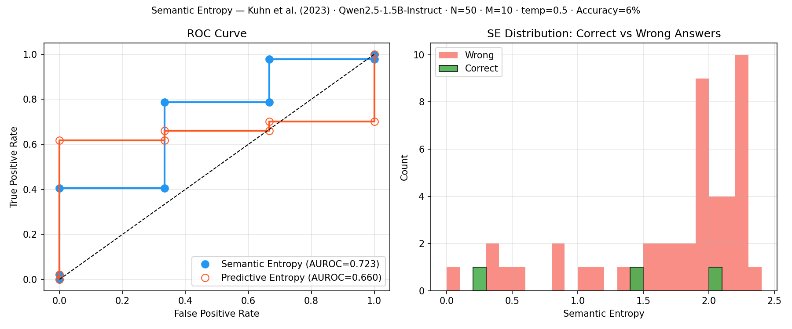
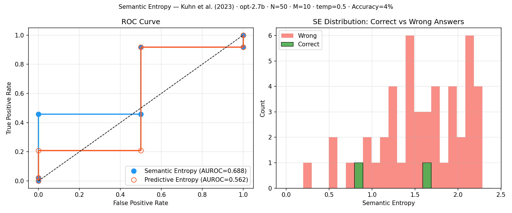

# Technical Design Doc: Hallucination Detection via Semantic Entropy

---

## 1. Introduction & Problem Definition

Large Language Models (LLMs) hallucinate — they produce confident-sounding outputs that are factually wrong. This is a fundamental reliability problem: a model can generate fluent, authoritative text about things it does not know.

The core challenge in detecting hallucinations is that **confidence is hard to measure from the outside**. The model does not say "I'm not sure about this." It just generates tokens.

One natural signal is the model's own token probabilities. If the model assigns low probability to its output, it may be uncertain. But this fails in practice for a subtle reason: **natural language has many ways to say the same thing**. The model may be highly confident about a *meaning* while appearing uncertain at the token level simply because there are multiple valid phrasings.

> "Bell invented the telephone" and "The telephone was invented by Bell" mean the same thing, hence should be tied to the same semantic cluster.

A naive entropy measure over token sequences treats these as two different outcomes and inflates the uncertainty estimate — incorrectly flagging a confident answer as uncertain.

---

## 2. Method: Semantic Entropy

We implement **Semantic Entropy** (Kuhn et al, 2023), which computes entropy over *meanings* rather than token sequences.

### 2.1 Why not token-level entropy?

Standard **Predictive Entropy (PE)** measures the spread of the model's output distribution at the token level:

```
PE = -∑_s  p(s|x) · log p(s|x)
```

This is inflated by paraphrases — semantically identical answers that differ in wording. **Semantic Entropy (SE)** collapses paraphrases into a single cluster before computing entropy:

```
SE = -∑_c  p(c|x) · log p(c|x)
     where p(c|x) = ∑_{s ∈ c} p(s|x)
```

High SE means the model generates answers with genuinely different *meanings* — a strong hallucination signal.

### 2.2 The three steps

**Step 1 — Sample**

Draw M=10 completions from the LLM at temperature T=0.5. Temperature 0.5 balances diversity and accuracy — too low and all samples are identical (no signal), too high and accuracy degrades (noisy signal). Kuhn et al. validate this empirically.

For each completion, we compute its **length-normalised log-probability**:

```
log_prob_normalised = (1/N) · ∑_i log p(token_i | context, tokens_{<i})
```

Length normalisation ensures short and long answers are comparable — without it, longer sequences are penalised simply for having more tokens.

**Step 2 — Cluster by meaning**

We use **DeBERTa-large** (He et al., 2020), a 400M parameter model fine-tuned on the Multi-NLI dataset, to check whether two answers mean the same thing. For each pair (A, B), we run the NLI model in both directions:

```
A entails B  AND  B entails A  →  semantically equivalent  →  same cluster
```

Both directions must hold. A one-way implication is not enough: "Paris is in France" entails "Paris exists" but they do not mean the same thing.

We use a greedy clustering algorithm that exploits **transitivity**: each new answer is compared against only one representative per existing cluster, not every member. This reduces worst-case comparisons from O(M²) to O(M·C), where C is the number of clusters — typically much smaller than M.

**Step 3 — Compute Semantic Entropy**

Sum probabilities within each cluster, then compute entropy over the cluster distribution:

```
p(cluster_c) = ∑_{s ∈ c} exp(log_prob_s)   (normalised across all clusters)
SE = -∑_c  p(c) · log p(c)
```

SE = 0 means all samples share one meaning — the model is certain.  
SE = log(M) ≈ 2.3 (natural log, and M=10) means every sample has a distinct meaning — maximally uncertain.

---

## 3. System Design

### 3.1 Models

| Role | Model | Parameters | VRAM |
|---|---|---|---|
| LLM (generation) | `Qwen/Qwen2.5-1.5B-Instruct` | 1.5B | ~3 GB |
| NLI (clustering) | `cross-encoder/nli-deberta-v3-large` | 400M | ~1.5 GB |

Both models run on a single **NVIDIA T4 GPU (15 GB VRAM)** via Modal. The LLM dominates cost; DeBERTa is ~4× smaller and much cheaper per call.

### 3.2 Hyperparameters

| Parameter | Value | Rationale |
|---|---|---|
| Samples M | 10 | Kuhn et al. show diminishing returns beyond 10 |
| Temperature | 0.5 | Optimal balance of diversity vs accuracy (Kuhn et al., Fig. 3b) |
| Max new tokens | 128 | Sufficient for factual QA answers |
| SE threshold | ln(2) ≈ 0.69 | Entropy of a 50/50 split between two meanings |

### 3.3 From SE Score to AUROC

The goal is not to predict the answer to a question — it is to build a **meta-detector** that predicts whether the model's generated answer is correct or a hallucination. SE is the score that drives this detector. Here is how it materialises the ROC curve:

**Step 1 — Generate the primary answer**

For each question $x$, generate a single primary answer $y'$. Kuhn et al. use beam search (`num_beams=5`) for a stable, deterministic output. In our implementation we use `most_common_answer` — the representative of the highest-probability semantic cluster from the M=10 samples — which serves the same role without an extra inference call.

**Step 2 — Compute the uncertainty score (SE)**

Separately sample $M=10$ answers at temperature 0.5. Cluster them with DeBERTa NLI. Compute SE. This single scalar is the score for the ROC curve — every question gets exactly one SE value.

*Numerical example — "Who invented the telephone?"*

```
s1:  "Alexander Graham Bell invented it in 1876."  log_prob = -0.12  ┐
s2:  "The telephone was invented by Bell in 1876."  log_prob = -0.15  ├─ Cluster 1  p = 0.95
s3:  "Bell is credited with the telephone."         log_prob = -0.18  ┘
...
s10: "Nikola Tesla invented the telephone."         log_prob = -2.10  ── Cluster 2  p = 0.05

SE = -(0.95·log 0.95 + 0.05·log 0.05) = 0.20
```

The highest-probability cluster (Cluster 1) wins — its representative `s1` becomes `most_common_answer`.

**Step 3 — Define ground truth labels**

Compare `most_common_answer` against the gold aliases from TriviaQA using RougeL:

$$\text{label} = \begin{cases} 0 \ (\text{correct}), & \text{RougeL}(y', y) > 0.3 \\ 1 \ (\text{hallucination}), & \text{RougeL}(y', y) \le 0.3 \end{cases}$$

For this example: RougeL("Alexander Graham Bell invented it in 1876.", "alexander graham bell") = 0.9 > 0.3 → **label = 0 (correct)**.

After running all 50 questions, each has exactly one (SE score, label) pair:

```
question  1:  SE = 0.20,  label = 0  (correct)
question  2:  SE = 1.85,  label = 1  (hallucination)
question  3:  SE = 0.95,  label = 1  (hallucination)
...
question 50:  SE = 1.42,  label = 0  (correct)
```

**Step 4 — Sweep threshold $\tau$ to build the ROC curve**

For each value of $\tau$ from 0 to $\max(SE)$:

$$\text{Predict hallucination} = \begin{cases} \text{True (Positive)}, & SE \ge \tau \\ \text{False (Negative)}, & SE < \tau \end{cases}$$

At $\tau = 1.0$ using the four questions above:

| Question | SE | Label | Prediction | Outcome |
|---|---|---|---|---|
| 1 | 0.20 | 0 (correct) | negative | **TN** |
| 2 | 1.85 | 1 (hallucination) | positive | **TP** |
| 3 | 0.95 | 1 (hallucination) | negative | **FN** |
| 50 | 1.42 | 0 (correct) | positive | **FP** |

Sweeping $\tau$ across all values traces the full ROC curve.

**Step 5 — AUROC**

The area under the ROC curve equals the probability that a randomly chosen hallucinated answer has higher SE than a randomly chosen correct answer:

- AUROC = 0.5 → SE is no better than random  
- AUROC = 1.0 → SE perfectly separates hallucinations from correct answers

AUROC is appropriate here because we care about *ranking* — which answers to trust — not classification at a fixed threshold.

### 3.4 Dataset: TriviaQA (closed-book)

We evaluate on **TriviaQA** `rc.nocontext` (validation set) — 17,944 trivia questions answered from memory, with no supporting document. Closed-book is the right setting because it forces genuine uncertainty: the model either knows the answer or it doesn't.

**Correctness criterion:** RougeL(model answer, any gold alias) > 0.3, following Kuhn et al.

RougeL is the F-score of the Longest Common Subsequence (LCS) between reference $X$ (length $m$) and generated answer $Y$ (length $n$):

$$R_{lcs} = \frac{LCS(X,Y)}{m}, \quad P_{lcs} = \frac{LCS(X,Y)}{n}$$

$$\text{RougeL} = \frac{(1+\beta^2)\,R_{lcs}\,P_{lcs}}{R_{lcs} + \beta^2 P_{lcs}}, \quad \beta=1$$

We check the model's best answer against every gold alias; a match ($\text{RougeL} > 0.3$) on any alias counts as correct.

Example item:
```python
{
    "question": "Which American-born Sinclair won the Nobel Prize for Literature in 1930?",
    "answer": {"normalized_aliases": ["sinclair lewis", "harry sinclair lewis", ...]}
}
```

---

## 4. Results

All benchmarks: 50 questions, M=10 samples, temperature=0.5, TriviaQA `rc.nocontext` validation set, Modal T4 GPU.

### 4.1 Summary table

| Model | Instruction-tuned | Params | Accuracy | SE AUROC | PE AUROC | SE gain | LLM time/q | NLI time/q | Wall time |
|---|---|---|---|---|---|---|---|---|---|
| Qwen2.5-1.5B-Instruct | ✅ Yes | 1.5B | 6% | **0.723** | 0.660 | +0.064 | 10.7s | 2.5s | 103s |
| OPT-2.7B | ❌ No | 2.7B | 4% | 0.688 | 0.562 | +0.125 | 17.4s | 2.7s | — |
| Kuhn et al. OPT-30B | ❌ No | 30B | ~50% | ~0.830 | — | — | — | — | — |

SE consistently outranks PE as an uncertainty signal on both models.

**Why OPT-2.7B scores lower than Qwen-1.5B despite being larger:** OPT is a base model — it was only trained on raw text (books, web pages) and never fine-tuned to follow instructions. It produces answers via autocomplete from a `Q: ... A:` prompt, which makes its completions noisier and less structured. Some of that noise comes from *how to format the answer* rather than *which fact to state*, which dilutes the SE signal. This is **not a fair size comparison** — a proper apples-to-apples comparison would use an instruction-tuned model at both sizes, e.g. Qwen2.5-7B-Instruct or Llama-3.1-8B-Instruct.

Kuhn et al. use OPT-30B (also a base model) and report SE AUROC ~0.83 at ~50% accuracy — the high accuracy reflects model scale, not instruction tuning. The low accuracy here (4–6%) is expected for small models on closed-book trivia.

---

### 4.2 Qwen2.5-1.5B-Instruct



| | SE AUROC | PE AUROC | Avg SE correct | Avg SE wrong | Avg clusters correct | Avg clusters wrong |
|---|---|---|---|---|---|---|
| Qwen2.5-1.5B | 0.723 | 0.660 | 1.236 | 1.733 | 5.00 | 7.23 |

---

### 4.3 OPT-2.7B (base model)



| | SE AUROC | PE AUROC | Avg SE correct | Avg SE wrong | Avg clusters correct | Avg clusters wrong |
|---|---|---|---|---|---|---|
| OPT-2.7B | 0.688 | 0.562 | 1.243 | 1.565 | 5.00 | 6.67 |

---

## 5. Production Inference Architecture

### 5.1 Pipeline components

```
                    [User Prompt]
                         │
                         ▼
                  2. Swarm Sampler
                  (temp=0.5, M=10)
                         │
                         ▼
                    [M Samples]────────────────┐
                    │                          │
                    ▼                          ▼
          1. most_common_answer()         3. NLI Clusterer
                    │                      (DeBERTa)
                    │                          │
                    │                          ▼
                    │                     4. SE Calculator
                    │                          │
                    │                          ▼
                    │                      [SE Score]
                    │                          │
                    └───────────────────> 5. Decision Gate
                                               │
                ┌──────────────────────────────┴──────────────┐
                ▼                                             ▼
         SE < τ: PASS                                 SE ≥ τ: FLAG
      (return answer to user)                    (hallucination alert)
```

**1. most_common_answer** — the representative of the highest-probability semantic cluster from the M samples. This is the answer returned to the user. The paper uses a separate greedy/beam-search decode for this step; we avoid the extra inference call by reusing the samples already generated in step 2.

**2. Swarm Sampler** — draws M=10 independent completions at temperature 0.5 to probe the model's uncertainty landscape. These are used for both selecting the best answer and computing SE.

**2. Swarm Sampler** — probes the model's uncertainty landscape. Uses multinomial sampling at T=0.5 to draw M=10 independent completions. These are used only for entropy estimation, not returned to the user. Kuhn et al. validate empirically (Fig. 3b) that M=10 balances diversity and cost well.

**3. NLI Clusterer** — resolves linguistic variance by grouping the M samples into semantic equivalence classes using bidirectional DeBERTa entailment. Exploits transitivity (greedy, O(M·C)) so each new sample is compared against one cluster representative, not all members.

**4. SE Calculator** — aggregates per-cluster probability mass from the log-probs recorded during sampling, then computes entropy over the cluster distribution. Output: a single scalar SE ∈ [0, log M].

**5. Decision Gate** — compares SE against threshold τ. Default τ = ln(2) ≈ 0.69 (entropy of a 50/50 split). In production this should be calibrated on a labelled validation set to match the desired precision/recall trade-off for the application.

---

### 5.2 REST API design

```
POST /detect
Content-Type: application/json

{
  "text": "Who invented the telephone?",
  "n_samples": 10,          // optional, default 10
  "temperature": 0.5        // optional, default 0.5
}
```

```json
{
  "answer":        "Alexander Graham Bell invented the telephone in 1876.",
  "is_uncertain":  false,
  "se_score":      0.301,
  "pe_score":      2.302,
  "n_clusters":    2,
  "latency_ms":    12800
}
```

The response gives the caller both the binary flag (`is_uncertain`) and the raw score (`se_score`) so downstream systems can apply their own threshold.

---

### 5.3 Scalability

### 5.3 Computational complexity

The bottleneck is **LLM inference**: M forward passes through the generative model per query. The NLI clustering is comparatively cheap — DeBERTa is 4× smaller than the LLM and the greedy algorithm keeps comparisons at O(M·C).

Per-query cost breakdown (T4, M=10, Qwen2.5-1.5B) — measured wall time averaged over 50 questions:

| Step | Time | Cost (T4 @ $0.59/hr) |
|---|---|---|
| LLM sampling (10 completions) | 10.5s | ~$0.0017 |
| NLI clustering (≤45 pairs) | 2.3s | ~$0.0004 |
| **Total** | **12.8s** | **~$0.0021** |

At 1M queries/day: ~$2,100/day on T4. Switching to batched vLLM inference and A10G GPUs would reduce this by ~3–5×.

### 5.4 Modal parallelism

The benchmark uses `score_question.map()` to dispatch questions to parallel Modal workers. Each worker loads models once on cold start and processes subsequent questions without reloading. At 50 questions, Modal spun up ~10 parallel containers — wall-clock time was ~3 minutes instead of ~7.5 minutes sequential.

This scales horizontally: 1,000 questions takes roughly the same wall-clock time as 50, just more containers.

### 5.5 Path to 1M users

| Bottleneck | Solution |
|---|---|
| LLM throughput | vLLM with continuous batching; PagedAttention |
| NLI throughput | Batch all M² pairs in a single DeBERTa forward pass |
| Cold start latency | Keep containers warm with `scaledown_window`; pre-warm on traffic spikes |
| Cost | Diversity-steered sampling (Park & Cho, NeurIPS 2025) — same AUROC with ~4 samples instead of 10 |

---

## 6. Trade-offs & Limitations

**Unsupervised, no labels required.** SE requires no task-specific training data — it runs on any LLM out of the box. This is the main practical advantage over supervised methods (e.g. Kadavath et al., 2022), which need labelled confidence datasets and degrade under distribution shift.

**Requires access to log-probabilities.** SE needs token-level log-probs from the generating model. This rules out black-box APIs that only return text. Any open-source model works; GPT-4 via the OpenAI API does not.

**NLI entailment is imperfect.** The DeBERTa NLI model achieves 92.7% accuracy on the semantic equivalence task (Kuhn et al.). Errors in either direction — false equivalences or missed paraphrases — add noise to the SE estimate. A stronger NLI model improves results.

**Small model, low accuracy.** A 1.5B model has limited factual recall. SE detects uncertainty well even here, but the practical value of hallucination detection increases with model size — a 7B+ model would be more appropriate for production.

**SE does not detect confident hallucinations.** If the model is consistently wrong but consistently wrong in the same way (all 10 samples say the same incorrect thing), SE will be low and the answer will not be flagged. SE detects *uncertainty*, not *incorrectness per se*.

---

## 7. Future Work

**Semantic Entropy Probes — Kossen et al. (2024).** The primary production path. Replaces M=10 LLM generations with a single forward pass + O(d) linear probe on the frozen hidden state at the last input token position. Eliminates NLI clustering entirely at inference time. Training requires a one-time offline run to collect (hidden state, SE label) pairs, which is cheap. Implementation complete in `src/ctgt/probe.py`; data collection and probe upload pipeline in `modal_app.py`. Recommended model for SEP training: `Mistral-7B-Instruct-v0.3` or `meta-llama/Llama-3.1-8B-Instruct` — both instruction-tuned at a scale where accuracy is meaningful.

**INSIDE — Chen et al., ICLR 2024.** The most ambitious internal-state approach. Proposes two mechanisms:

- *EigenScore*: generates K=10 responses, extracts last-token embeddings at the **middle transformer layer** (≈ L/2), constructs the K×K covariance matrix Σ = Z^T · J · Z, and scores uncertainty as (1/K) Σᵢ log(λᵢ) over the eigenvalues. Semantic divergence spreads eigenvalue mass, raising the score. Outperforms SE (AUROC 82.7% vs ~65%) by operating in dense embedding space where paraphrase conflation is automatic.

- *Feature Clipping*: a test-time activation intervention that truncates extreme values in the penultimate layer via a **PyTorch forward hook** (not just reading — actually modifying activations). A memory bank of N=3000 calibration embeddings sets the clip percentile (p=0.2). Reduces overconfident generations without retraining.

Key engineering note: EigenScore and feature clipping both require **forward hooks** (`register_forward_hook`) rather than the passive `output_hidden_states=True` approach we currently use for SEPs. This distinction is documented with implementation notes in `src/ctgt/inside.py`.

**Diversity-steered sampling (Park & Cho, NeurIPS 2025)** — penalise semantically redundant outputs during generation, so fewer samples (≈4 instead of 10) are needed for the same AUROC. Direct 60% reduction in LLM cost with no architecture changes.

**Larger models** — swap `Qwen2.5-1.5B` for `Qwen2.5-7B` or `Llama-3.1-8B`. Expected to significantly improve both accuracy and AUROC, approaching the paper's 30B results.

**p(True) baseline** — Kadavath et al. (2022): ask the model "is your answer correct?" as a self-evaluation signal. Adds a third AUROC comparison point alongside SE and PE.

---

## 8. Method Landscape

| Paper | Internal access | What it does |
|---|---|---|
| Farquhar / Kuhn (Nature 2024) | Logprobs only | M=10 samples → NLI cluster → entropy over meanings |
| Kossen et al. SEPs (2024) | Hidden states (read) | Linear probe on frozen last-token activation; single forward pass at inference |
| Chen et al. INSIDE (ICLR 2024) | Hidden states (read + modify) | EigenScore on mid-layer covariance + forward-hook activation clipping |

The progression from Kuhn → Kossen → INSIDE represents increasing depth of access to model internals: from output probabilities only, to reading internal representations, to modifying them at inference time.

---

## References

- Farquhar, S., Kossen, J., Kuhn, L., & Gal, Y. (2024). *Detecting Hallucinations in Large Language Models Using Semantic Entropy.* Nature. **1561 citations.** [arXiv:2303.08896](https://arxiv.org/abs/2303.08896)
- Kuhn, L., Gal, Y., & Farquhar, S. (2023). *Semantic Uncertainty: Linguistic Invariances for Uncertainty Estimation in Natural Language Generation.* ICLR 2023. [arXiv:2302.09664](https://arxiv.org/abs/2302.09664)
- Kossen, J., Han, J., Razzak, M., Schut, L., Malik, S., & Gal, Y. (2024). *Semantic Entropy Probes: Robust and Cheap Hallucination Detection in LLMs.* **161 citations.** [arXiv:2406.15927](https://arxiv.org/abs/2406.15927)
- Chen, C., Liu, K., Chen, Z., Gu, Y., Wu, Y., Tao, M., Fu, Z., & Ye, J. (2024). *INSIDE: LLMs' Internal States Retain the Power of Hallucination Detection.* ICLR 2024. **356 citations.** [arXiv:2402.03744](https://arxiv.org/abs/2402.03744)
- Park, J. W., & Cho, K. (2025). *Efficient Semantic Uncertainty Quantification in Language Models via Diversity-Steered Sampling.* NeurIPS 2025. [neurips.cc](https://neurips.cc/virtual/2025/loc/san-diego/poster/118777)
- He, P. et al. (2020). *DeBERTa: Decoding-Enhanced BERT with Disentangled Attention.* [arXiv:2006.03654](https://arxiv.org/abs/2006.03654)
- Kadavath, S. et al. (2022). *Language Models (Mostly) Know What They Know.* [arXiv:2207.05221](https://arxiv.org/abs/2207.05221)
- Joshi, M. et al. (2017). *TriviaQA: A Large Scale Distantly Supervised Challenge Dataset for Reading Comprehension.* ACL 2017. [arXiv:1705.03551](https://arxiv.org/abs/1705.03551)
